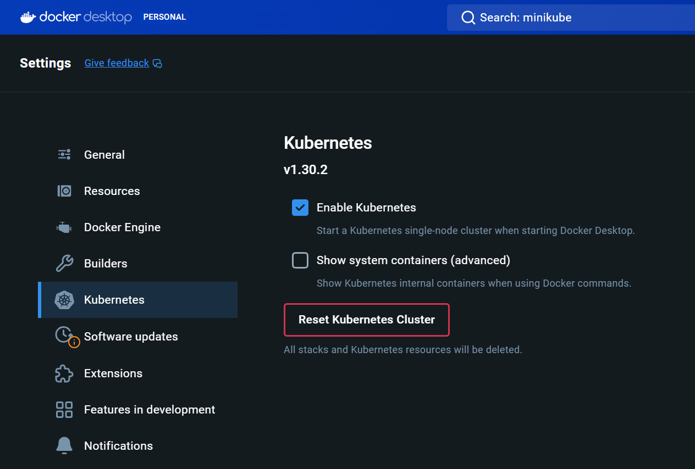
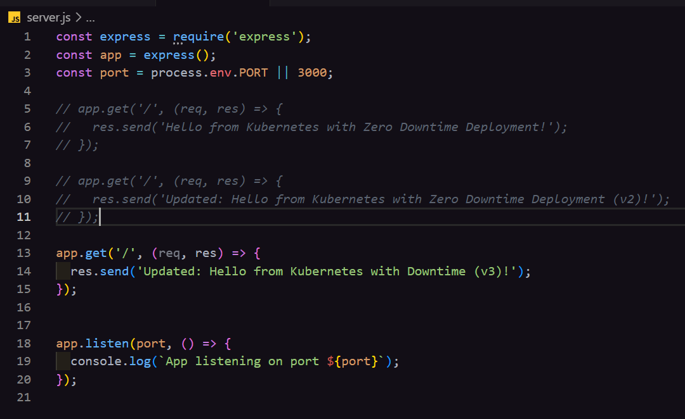
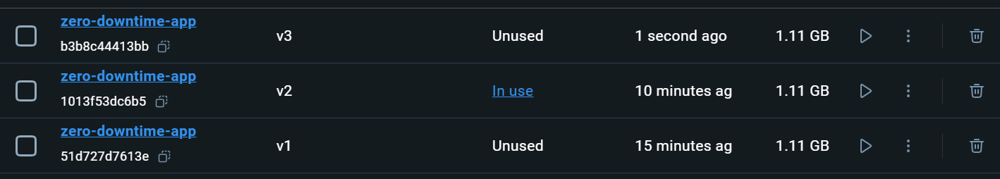
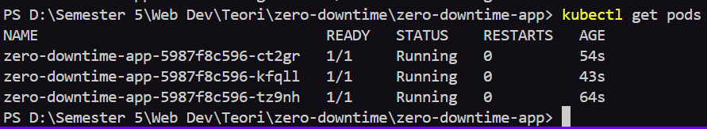
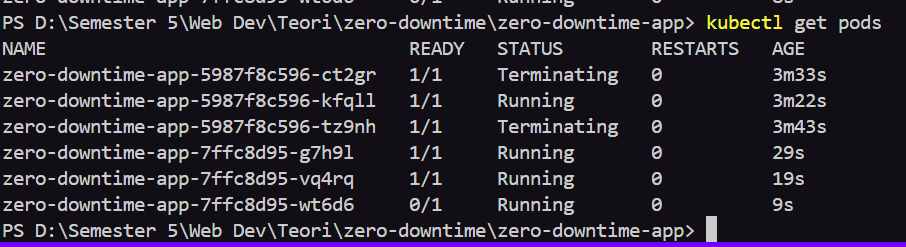
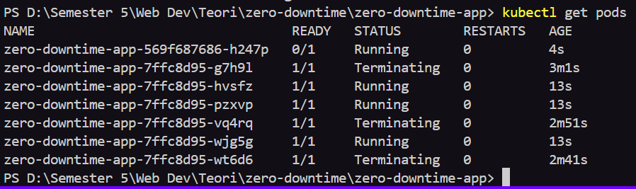
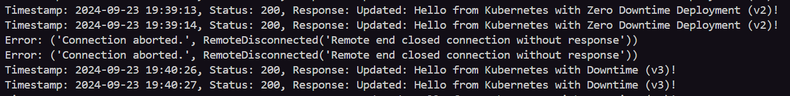

# Author
## `Roy Aziz Barera`

## Install
`Docker`
`Kubernets`

## Environtment
`Node`
``` bash
  mkdir zero-downtime-app
  cd zero-downtime-app
  npm init -y
  npm install express
```


## Experiment
Setup Code first then create 3 version images for experiment \
Create deployment.yaml for applying kubernets into project

``` bash
  docker build -t zero-downtime-app:v1 .
  docker build -t zero-downtime-app:v2 .
  docker build -t zero-downtime-app:v3 .
```



For applying update, changes the image version in deployment.yaml
``` bash
  kubctl apply -f deployment.yaml
``` 

## Testing
Make requests to the server using python continuously, then capture the result.

- v1


- rolling update


- v3 with downtime

